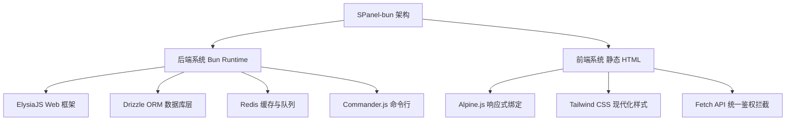
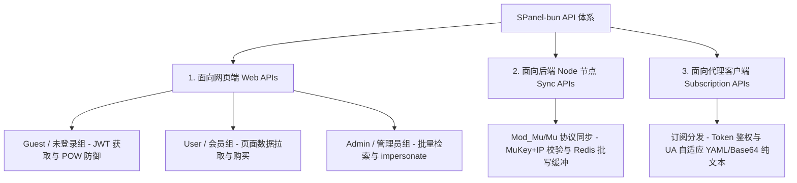

# SPanel-bun 系统重写架构设计方案

本项目旨在将基于 PHP 7.4 (Slim 3.x / Smarty 3.x) 的 VPN/代理服务管理面板 **SPanel**，使用 **Bun** 和 **TypeScript** 进行现代化重构。

重构核心原则：**前后端完全分离，后端 100% API 化，前端使用纯静态 HTML 页面**。在保留原有业务逻辑、MySQL 5.6 数据库表结构和后端节点兼容性的前提下，实现极致的吞吐量、极低的延迟以及极佳的开发维护体验。

---

## 目录
1. [技术栈选型与分析](#1-技术栈选型与分析)
2. [项目整体架构设计](#2-项目整体架构设计)
3. [核心业务与 API 面向主体分类设计](#3-核心业务与-api-面向主体分类设计)
4. [项目目录结构](#4-项目目录结构)
5. [数据一致性与核心业务红线](#5-数据一致性与核心业务红线)
6. [平滑迁移与部署方案](#6-平滑迁移与部署方案)

---

## 1. 技术栈选型与分析

为了实现高性能与高开发效率，经过对比分析，选定以下技术栈：



### 1.1 后端技术栈 (Back-end)
*   **运行环境 (Runtime)**：**Bun 1.x**
    *   *选型理由*：极速的冷启动与运行速度，原生支持 TypeScript，内置高性能 HTTP 服务器（`Bun.serve`），拥有出色的文件/网络 I/O 吞吐能力，相比 Node.js 内存占用更低。
*   **Web 框架 (Web Framework)**：**ElysiaJS**
    *   *选型理由*：专为 Bun 优化的高性能框架，路由匹配速度极快。其独有的类型安全特性（与静态代码解析相结合）可以在开发时自动进行类型推导。最核心的是它提供**原生的 Swagger/OpenAPI 生成**，这极度契合“后端完全 API 化”的诉求，极大地方便了前端对接与接口联调。
*   **数据库 ORM (ORM)**：**Drizzle ORM** + `mysql2`
    *   *选型理由*：目前 TypeScript 领域性能最高、类型安全最彻底的 ORM。它不像 Prisma 那样有笨重的 Query Engine 二进制文件，而是采用轻量级、接近原生 SQL 语法的链式设计，对高并发 API 服务至关重要。支持直接从既有 MySQL 数据库逆向生成 Schema，做到无缝兼容旧表。
*   **缓存与消息队列 (Cache & Queue)**：**Redis**
    *   *选型理由*：用于高速存取临时数据（如用户在线状态、活跃 IP 列表、限流器滑动窗口等），并作为轻量级队列应对高并发流量上报。

### 1.2 前端技术栈 (Front-end)
SPanel 原版使用 Smarty 在服务器端渲染（SSR）页面。为了配合完全 API 化的后端，前端将使用**纯静态 HTML 页面**，无需复杂的编译/打包流程（不强依赖 Next.js 或 Vite 构建，但保留通过简单构建分发静态文件的灵活性）。
*   **响应式绑定 (Reactive Binding)**：**Alpine.js** 或 **petite-vue**
    *   *选型理由*：声明式极简响应式框架，可以直接写在静态 HTML 的标签中。体积小巧（仅十几KB），免去了 React/Vue 大型的 Webpack/Vite 脚手架配置，能够完美在纯静态 HTML 页面中实现“数据拉取## 3. 核心业务与 API 面向主体分类设计

为了实现精准的安全防御、协议隔离和性能调优，SPanel-bun 的 API 接口体系按 **调用主体与场景** 划分为三大类：**面向网页端**、**面向后端 Node 节点** 以及 **面向代理客户端**。



---

### 3.1 1. 面向网页端接口设计 (Web Front-end APIs)
此类接口直接对接运行于浏览器端的静态 HTML (由 Alpine.js 驱动)，通信协议为 **HTTPS + JSON**，会话状态管理采用 **JWT 无状态令牌**，并通过 `Authorization: Bearer <JWT>` 头部进行传输。

#### 3.1.0 全局标准响应格式 (JSON Standard Response)
```json
{
  "code": 200,
  "message": "操作成功",
  "data": {}
}
```
*当发生错误时，`code` 映射标准 HTTP 状态码 (400, 401, 403, 429, 500)，`message` 返回可读的简体中文错误提示，`data` 设为 `null`。*

#### 3.1.1 游客与未登录模块 (Guest Group - `/api/v1/auth/*`)
服务于未登录场景下的基础鉴权与验证逻辑。此命名空间下的写入操作属于敏感端点，在 CC 攻击或高负载下将自适应挂载 **人机验证 (POW / Captcha)**。

##### 1. 用户登录 (Account Login)
*   **端点**: `POST /api/v1/auth/login`
*   **请求头**:
    *   `Content-Type: application/json`
    *   `X-Client-POW`: `Nonce_String` *(当系统处于 CC 攻击防御模式时为必填)*
*   **请求体**:
    ```json
    {
      "email": "user@example.com",
      "password": "my_secure_password_123",
      "captcha_id": "redis_captcha_uuid_987",
      "captcha_code": "ax8d",
      "pow_nonce": "184729"
    }
    ```
*   **返回数据 (200 OK)**:
    ```json
    {
      "code": 200,
      "message": "登录成功",
      "data": {
        "token": "eyJhbGciOiJIUzI1NiIsInR5cCI6IkpXVCJ9...",
        "user": {
          "id": 42,
          "email": "user@example.com",
          "is_admin": 0
        }
      }
    }
    ```

##### 2. 用户注册 (Account Register)
*   **端点**: `POST /api/v1/auth/register`
*   **请求体**:
    ```json
    {
      "email": "newuser@example.com",
      "password": "strongpassword123",
      "email_code": "843291",
      "invite_code": "VIP888",
      "pow_nonce": "938210"
    }
    ```
*   **返回数据 (200 OK)**:
    ```json
    {
      "code": 200,
      "message": "注册成功，请使用新账号登录",
      "data": null
    }
    ```

##### 3. 发送邮箱验证码 (Send Email Verification Code)
*   **端点**: `POST /api/v1/auth/send-code`
*   **限频策略**: Redis 记录，单 IP 及单邮箱每 60 秒限发 1 次，每小时最多 3 次。
*   **请求体**:
    ```json
    {
      "email": "user@example.com",
      "pow_nonce": "472891"
    }
    ```
*   **返回数据 (200 OK)**:
    ```json
    {
      "code": 200,
      "message": "验证码已成功送达您的邮箱",
      "data": null
    }
    ```

##### 4. 获取图形验证码 (Get SVG Captcha)
*   **端点**: `GET /api/v1/auth/captcha`
*   **返回数据 (200 OK)**:
    ```json
    {
      "code": 200,
      "message": "验证码生成成功",
      "data": {
        "captcha_id": "redis_captcha_uuid_987",
        "captcha_svg": "<svg xmlns=\"http://www.w3.org/2000/svg\" ... </svg>"
      }
    }
    ```

> [!TIP]
> **游客端防御逻辑：**
> 1. **自适应工作量证明 (POW)**: 服务器接收到写入请求时，若当前系统瞬时 QPS 超过设定红线，将激活 POW 限制。客户端必须在 Web Worker 中通过暴力枚举寻找一个 Nonce（`pow_nonce`），使得 `sha256(ClientIP + ServerChallenge + pow_nonce)` 满足前缀为 `0000` (4个十六进制零，难度可动态上调) 的哈希。
> 2. **图形验证码双检**: Captcha SVG 在后台生成的同时，文本内容写入 Redis (`captcha:<uuid>` -> `ax8d`, TTL 300秒)。登录或注册时一经核对立即在 Redis 中执行 `DEL` 销毁，防止基于既有图形的重放攻击。

---

#### 3.1.2 会员控制台模块 (User Group - `/api/v1/user/*`)
提供给已登录会员，用于控制台业务交互。该命名空间下的所有请求**必须**在 Headers 中携带 `Authorization: Bearer <JWT>` 凭证。

##### 1. 会员控制面板总览 (Fetch Dashboard Overview)
*   **端点**: `GET /api/v1/user/dashboard`
*   **返回数据 (200 OK)**:
    ```json
    {
      "code": 200,
      "message": "数据拉取成功",
      "data": {
        "user_info": {
          "id": 42,
          "email": "user@example.com",
          "money": "150.75",
          "class": 1,
          "class_expire": "2026-12-31 23:59:59"
        },
        "traffic_stats": {
          "u": "1099511627776",
          "d": "549755813888",
          "transfer_enable": "5497558138880",
          "unused_traffic": "3848290697216"
        },
        "announcement": {
          "id": 5,
          "title": "SPanel-bun 高速重构版正式上线",
          "content": "<p>欢迎体验全新极速控制台！</p>",
          "date": "2026-05-21 12:00:00"
        },
        "checkin_status": {
          "can_checkin": true,
          "last_checkin_time": "2026-05-20 08:30:12"
        }
      }
    }
    ```
    *注意：流量指标 `u`（已上传字节）、`d`（已下载字节）和 `transfer_enable`（总可用字节）在 JSON 中统一以高精度 **字符串形式的 BIGINT (Bytes)** 形式下发，防止 JavaScript 接收大数字时产生 IEEE 754 精度丢失。*

##### 2. 签到获取流量 (User Checkin)
*   **端点**: `POST /api/v1/user/checkin`
*   **返回数据 (200 OK)**:
    ```json
    {
      "code": 200,
      "message": "签到成功！您获得了 10.24 GB 附加流量！",
      "data": {
        "traffic_reward": "10995116288",
        "next_checkin_after": 86400
      }
    }
    ```

##### 3. 获取可用节点列表 (Fetch Available Nodes)
*   **端点**: `GET /api/v1/user/node`
*   **返回数据 (200 OK)**:
    ```json
    {
      "code": 200,
      "message": "节点列表拉取成功",
      "data": [
        {
          "id": 1,
          "name": "香港 CN2 高速 01",
          "type": "Shadowsocks",
          "rate": "1.0",
          "info": "精品中转线路，支持延迟检测",
          "status": "良好",
          "load": 24.5
        },
        {
          "id": 2,
          "name": "东京 BGP 02",
          "type": "Trojan",
          "rate": "0.5",
          "info": "大带宽冷备节点，特惠折率",
          "status": "良好",
          "load": 12.8
        }
      ]
    }
    ```
    *后台过滤核心：查询节点表，在内存中执行二进制位与校验 `(user.node_group & node.node_group) > 0` 且等级校验 `user.class >= node.node_class`，仅向前端透传该用户有权使用的节点。*

##### 4. 套餐商品购买下单 (Buy Package / Shop Order)
*   **端点**: `POST /api/v1/user/buy`
*   **请求体**:
    ```json
    {
      "shop_id": 3,
      "coupon_code": "SAVE20"
    }
    ```
*   **返回数据 (200 OK)**:
    ```json
    {
      "code": 200,
      "message": "购买成功！新套餐已即时生效",
      "data": {
        "order_id": "202605210948321049",
        "price_paid": "79.20",
        "new_expire_time": "2026-06-21 23:59:59"
      }
    }
    ```
    *业务核心红线：在 Drizzle 的 `db.transaction` 中级联锁定用户余额，引入 `decimal.js` 精密运算 `money` 扣费，防止并发扣款负余额漏洞。*

---

#### 3.1.3 超级管理后台模块 (Admin Group - `/api/v1/admin/*`)
超级管理员专属，提供全平台资源管理及运维能力。接口必须校验用户的 JWT 并且满足 `user.is_admin === 1`。

##### 1. 用户管理分页筛选与检索 (Fetch Users with Server Pagination)
*   **端点**: `GET /api/v1/admin/user`
*   **查询参数**: `?page=1&limit=20&search=test@example.com&filter_class=1`
*   **返回数据 (200 OK)**:
    ```json
    {
      "code": 200,
      "message": "获取成功",
      "data": {
        "pagination": {
          "total_items": 1420,
          "total_pages": 71,
          "current_page": 1,
          "limit": 20
        },
        "users": [
          {
            "id": 42,
            "email": "user@example.com",
            "money": "150.75",
            "class": 1,
            "transfer_enable": "5497558138880",
            "u": "1099511627776",
            "d": "549755813888",
            "enable": 1
          }
        ]
      }
    }
    ```

##### 2. 管理员无密模拟登录 (Impersonate User)
*   **端点**: `POST /api/v1/admin/user/impersonate`
*   **请求体**:
    ```json
    {
      "target_uid": 42
    }
    ```
*   **返回数据 (200 OK)**:
    ```json
    {
      "code": 200,
      "message": "一次性模拟令牌生成成功",
      "data": {
        "impersonate_token": "redis_impersonate_8fa2bc7190ee"
      }
    }
    ```
    *后台实现机制：生成长度为 32 位的随机高熵令牌写入 Redis 缓存 `impersonate:token:<token>` -> `42`，TTL 为 60 秒，仅限一次性消费。前端在浏览器新标签页携带该 Token 调用 Guest 的鉴权换取接口 `/api/v1/auth/impersonate-login` 兑换该用户的临时常规 JWT，解决无密排错难题。*

##### 3. 新建节点 (Create Node)
*   **端点**: `POST /api/v1/admin/node`
*   **请求体**:
    ```json
    {
      "name": "新加坡 联通优化 03",
      "server": "sg1.spanel-node.xyz",
      "method": "aes-256-gcm",
      "custom_config": "{\"port\":443,\"network\":\"ws\"}",
      "rate": "1.2",
      "node_group": 3,
      "node_class": 2,
      "node_speedlimit": 100
    }
    ```
*   **返回数据 (200 OK)**:
    ```json
    {
      "code": 200,
      "message": "节点创建成功",
      "data": {
        "node_id": 14
      }
    }
    ```

---

### 3.2 2. 面向后端 Node 节点同步接口设计 (Backend Node Sync APIs)
面向中转/边缘代理节点的 shadowsocks-mod、xray 等后台同步进程。此组接口对性能、并发处理以及数据吞吐量要求极度严苛。

#### 3.2.0 安全防线与无状态快速鉴权
1.  **双因子鉴权**: 节点在发起 HTTPS 请求时，必须在 Headers 中携带 `X-Node-Key` (对应系统 `sp_config` 表中的全局 `muKey` 密钥)。同时，后端网关会提取请求来路物理 IP，核对 `node` 表中该 `node_id` 下登记的物理 IP 白名单。
2.  **高性能网关拦截**: 一经鉴权成功，直接在内存上下文缓存此物理节点的 `node_id`，以无状态模式极速向下透传，免除任何 Session 解析和 JWT 校验。

#### 3.2.1 获取授权连接用户列表 (Mod_Mu Get Users)
*   **端点**: `GET /api/mod_mu/users`
*   **请求头**:
    *   `X-Node-Key`: `global_mukey_string_secret`
*   **查询参数**: `?node_id=14`
*   **性能保证与 Redis 托管**:
    节点一分钟轮询一次用户列表以更新本地授权。若有 200 个物理节点同时轮询，直查 MySQL 会产生极大并发负载。重构后，系统采用 Redis 哈希哈希表 `node:sync:users` 做内存缓存级。当用户套餐过期、流量超限或属性变更时，由主站向 Redis 推送清理指令，使对应记录失效，下一次节点轮询将穿透重载并刷新该 Redis 记录。
*   **返回数据 (200 OK)**:
    ```json
    {
      "ret": 1,
      "data": [
        {
          "id": 42,
          "port": 10042,
          "passwd": "ss_connection_password",
          "uuid": "4fa8178d-190f-488b-a88e-6701b22822d1",
          "method": "aes-256-gcm",
          "enable": 1
        }
      ]
    }
    ```

#### 3.2.2 批量流量消费上报 (Mod_Mu Traffic Update)
*   **端点**: `POST /api/mod_mu/users/traffic`
*   **请求体**:
    ```json
    {
      "node_id": 14,
      "data": [
        { "u": 524288000, "d": 2147483648, "user_id": 42 },
        { "u": 0, "d": 1073741824, "user_id": 99 }
      ]
    }
    ```
*   **返回数据 (200 OK)**:
    ```json
    {
      "ret": 1,
      "data": "ok"
    }
    ```

> [!IMPORTANT]
> **流量高并发抗峰与批量异步写入缓冲机制 (Batch Buffer Queue):**
> 1. **Redis 快速落盘**: 后端接口接收到节点的流量上报后，**绝不直接直写更新 MySQL**。接口仅进行格式校验后，瞬间将上报数据以 JSON 字符串形式推入 Redis 列表队列 `queue:traffic:incoming` 中，并在 1 毫秒内向节点极速返回 `"ret": 1` 成功标志，实现节点数据处理解耦。
> 2. **异步 Worker 归并**: 系统常驻一个流量处理 Worker 进程 (`scheduler.ts`)，每 5 秒钟从 `queue:traffic:incoming` 队列中批量取出全部累积上报。
> 3. **合并写入**: 在内存中将取出的流量上报以 `user_id` 为 Key 进行聚合归并，算出各个 UID 的累计 `sum_u` 和 `sum_d`。
> 4. **数据库事务更新**: 归并完成后，Worker 使用 Drizzle ORM，在单个事务中通过批量 SQL `UPDATE user SET u = u + sum_u, d = d + sum_d WHERE id = user_id` 执行数据库高能批量写入。这不仅避免了行锁竞争和死锁，更将数据库 IOPS 消耗降至原来的 1% 以下。

#### 3.2.3 活跃 IP 上报 (Mod_Mu Report Alive IPs)
*   **端点**: `POST /api/mod_mu/users/aliveip`
*   **请求体**:
    ```json
    {
      "node_id": 14,
      "data": [
        { "ip": "203.0.113.5", "user_id": 42 },
        { "ip": "198.51.100.12", "user_id": 42 }
      ]
    }
    ```
*   **后台逻辑**:
    接收到的在线 IP 数据直接写入 Redis 带有自毁 TTL 的有序集合 `node:online:ips`。此项数据主要用于判定用户是否多 IP 越权连接、用于前台在线统计，不在 MySQL 中进行持久化，避免无意义的表碎片产生。

---

### 3.3 3. 面向代理客户端订阅分发接口设计 (Client Subscription APIs)
此类接口直接对接用户手机、电脑上的主流代理客户端软件。此类请求必须做到**格式极致纯净、高稳定与快速自适应分发**。

#### 3.3.1 聚合配置分发 (Client Subscription Engine)
*   **端点**: `GET /link/:token`
*   **路径参数**: `:token` (即用户表中的唯一高熵标识 `uuid` 字段值)
*   **请求头**:
    *   `User-Agent`: 由代理客户端自动发送，例如 `"ClashforWindows/0.20.10 Mihomo"`, `"Surge/2539"`, `"Quantumult%20X/1.0.30"` 等。

#### 3.3.2 客户端 UA 自适应匹配与纯文本输出机制
分发引擎在拦截到请求后，通过对 `User-Agent` 头部进行不区分大小写的智能正则匹配，分流下发定制格式：

```mermaid
graph TD
    UA[获取客户端 User-Agent] --> CLASH{UA 包含 clash / mihomo ?}
    CLASH -- Yes --> YAML[1. 动态拼装并返回标准 Clash YAML 配置文件]
    CLASH -- No --> SURGE{UA 包含 surge ?}
    
    SURGE -- Yes --> CONF[2. 动态拼装并返回标准 Surge CONF 配置文件]
    SURGE -- No --> SHADOWROCKET{UA 包含 shadowrocket / quantumult / loon ?}
    
    SHADOWROCKET -- Yes --> BASE64[3. 提取全部可用节点代理串, 拼接并进行 Base64 编码的纯文本]
    SHADOWROCKET -- No --> DEFAULT[4. 默认返回标准 Base64 代理集合 (SS/SSR/Trojan 协议兼容)]
```

##### 1. 案例 A: 客户端为 Clash (YAML 格式直接输出)
*   **返回 Headers**:
    *   `Content-Type: text/yaml; charset=utf-8`
    *   `Content-Disposition: inline; filename="SPanel-Clash.yaml"`
*   **返回数据 (YAML 纯文本)**:
    ```yaml
    port: 7890
    socks-port: 7891
    allow-lan: false
    mode: Rule
    log-level: info
    proxies:
      - name: "香港 CN2 高速 01"
        type: ss
        server: sg1.spanel-node.xyz
        port: 10042
        cipher: aes-256-gcm
        password: "ss_connection_password"
    proxy-groups:
      - name: PROXY
        type: select
        proxies:
          - "香港 CN2 高速 01"
    rules:
      - DOMAIN-SUFFIX,google.com,PROXY
      - MATCH,DIRECT
    ```

##### 2. 案例 B: 客户端为 Shadowrocket (Base64 通用代理串直接输出)
*   **返回 Headers**:
    *   `Content-Type: text/plain; charset=utf-8`
*   **返回数据 (Base64 纯文本)**:
    ```text
    c3M6Ly9ZV1Z6TURJNU56VnliM0JwZEhsZmFXNW1ieTF6WlhKMlpYSjFiR1FnTURFZ2MyY2dZbXh2WTJzdFkyOXVibVZqZEdsdmJpMWxibUYwY21WZmNXRnphM2R2Y21Rc01UQTBNRjlrYVhSb1pYSXZZM012WVdWelptbHlhV04xZEhWelpYSXZhVzVtYjI5Zk1URXNZV1Z6TVE9PQ==
    ```
    *解码后原始文本示例*：
    ```text
    ss://YWVzLTI1Ni1nY206c3NfY29ubmVjdGlvbl9wYXNzd29yZEBzZzEuc3BhbmVsLW5vZGUueHl6OjEwMDQy#香港 CN2 高速 01
    trojan://trojan_password@tokyo.spanel-node.xyz:443#东京 BGP 02
    ```

> [!CAUTION]
> **订阅分发接口的极速响应红线:**
> 1. **全静态文本免路由逻辑**: 订阅分发接口直接处理大量自动更新的定时拉取，流量极大。接口绝不能引入任何臃肿的前端组件或 HTML 模板渲染，必须通过极简路由层直连数据提取 Services，自适应拼装完毕后直接以 `text/plain` 或 `text/yaml` 向客户端吐出。
> 2. **独立高熵 UUID**: 订阅 Token 必须与用户登录的 JWT Token 物理隔离。一旦用户发现订阅地址泄漏，在控制台点击“重置订阅”后，仅在数据库生成新的 `uuid` Token 并让老 Token 在 Redis 缓存中即时失效，无需强制用户退出当前 Web 登录会话。

---

### 3.4 4. 定时任务与内存调度器方案 (Scheduled Tasks & Cron)
原 PHP 项目使用外部的 Linux Crontab，每一分钟或每几小时通过 shell 调用 `php xcat checkjob` 等，导致高频的 PHP 进程冷启动开销。

SPanel-bun 采用 **“常驻内存调度器”与“单次 CLI 脚本”双线并存** 的方案：
1.  **常驻内存调度器 (`src/scheduler.ts`)**：
    *   在服务器上通过 Systemd 以守护进程运行一个 Bun 任务。
    *   利用 TypeScript 下的轻量级任务库（如 `node-cron` 或 Bun 原生 `setInterval`）。
    *   **优点**：进程常驻，省去了频繁创建与销毁 OS 进程的昂贵开销。极其适合每分钟一次的 `checkjob`，延迟低至微秒级。
2.  **CLI 脚本兼容模式 (`src/cli.ts`)**：
    *   使用 `Commander.js` 构建统一 CLI 入口。
    *   *命令行语法*：
        *   `bun run src/cli.ts createAdmin`
        *   `bun run src/cli.ts dailyjob`
        *   `bun run src/cli.ts checkjob` (单次执行)
        *   `bun run src/cli.ts backup`
    *   **优点**：与运维人员原有的 Crontab 习惯和 Shell 脚本 100% 兼容。在常驻进程异常死锁的极端情况下，可以无缝切换为传统 Crontab 模式作为备用备份方案。

---

## 4. 项目目录结构

```text
/root/git/SPanel-bun/
├── package.json                 # 依赖配置文件 (Elysia, Drizzle, ioredis等)
├── tsconfig.json                # TypeScript 编译选项
├── src/                         # 后端代码目录
│   ├── index.ts                 # Web 接口服务主入口
│   ├── scheduler.ts             # 常驻定时任务调度服务主入口
│   ├── cli.ts                   # 命令行工具主入口 (代替 xcat)
│   │
│   ├── config/                  # 系统全局配置与第三方连接池初始化
│   │   ├── app.ts               # 基础设置 (密钥、端口、限制等)
│   │   ├── database.ts          # Drizzle 数据库实例连接池
│   │   └── redis.ts             # Redis 实例连接池
│   │
│   ├── db/                      # 数据库底层 Schema 与 Migration
│   │   └── schema.ts            # 严格映射 MySQL 既有表结构的 Drizzle Schema
│   │
│   ├── controllers/             # RESTful 控制器层 (无状态，只处理请求与返回)
│   │   ├── auth/                # 未登录相关接口
│   │   ├── user/                # 用户面板操作接口
│   │   ├── admin/               # 管理端高权限接口
│   │   └── mu/                  # 节点同步 (Mu/Mod_Mu) 专用高并发接口
│   │
│   ├── middleware/              # Elysia 中间件层
│   │   ├── auth.ts              # JWT 鉴权与角色校验
│   │   ├── ip.ts                # 大陆 IP 禁止与 CDN 真实 IP 提取
│   │   └── node.ts              # 节点特权身份校验
│   │
│   ├── services/                # 核心业务逻辑服务层 (处理复杂业务)
│   │   ├── mail.ts              # SMTP 邮件发送服务
│   │   ├── gateway/             # 支付网关服务 (YftPay, ChenPay 逻辑)
│   │   ├── subscription.ts      # 订阅解析引擎 (Clash/Surge配置生成器)
│   │   └── telegram.ts          # Telegram 机器人交互服务
│   │
│   ├── utils/                   # 基础工具库
│   │   ├── hash.ts              # 密码 Argon2 转换
│   │   ├── tools.ts             # 流量格式化及辅助函数
│   │   └── qqwry.ts             # 纯 TypeScript 编写的 QQWry 物理 IP 定位解析器
│   │
│   └── commands/                # 命令行独立脚本逻辑 (供 cli.ts 挂载)
│       ├── createAdmin.ts       # 创建管理员
│       ├── dailyjob.ts          # 每日结算/重置流量任务
│       └── checkjob.ts          # 分钟级检测与清理任务
│
├── public/                      # 前端纯静态 HTML/JS 资源目录
│   ├── index.html               # 官网静态首页
│   ├── assets/                  # 公共前端资源
│   │   ├── css/                 # 统一样式系统 (包含暗黑模式、Glassmorphism规范)
│   │   └── js/                  # 核心 api.js 通信拦截器与统一工具
│   ├── auth/                    # 认证模块静态页面 (login.html, register.html)
│   ├── user/                    # 用户面板模块静态页面 (dashboard.html, nodes.html)
│   └── admin/                   # 管理面板模块静态页面 (dashboard.html, users.html)
│
└── plans/                       # 文档与规约目录
    └── init/
        └── Architected-design.md # 本架构设计文档
```

---

## 5. 数据一致性与核心业务红线

为了确保完美继承原 Slim/PHP 系统的财务数据与核心规则，重写过程中**必须严格执行以下红线规范**：

1.  **流量单位一致性**：数据库中的所有流量相关字段（如用户表中的 `u` 已上传, `d` 已下载, `transfer_enable` 总流量）必须保持统一，在内存、传输和持久化存储中**全部使用 BIGINT (字节) 作为单位**，不得在计算中引入浮点转换以防精度丢失。
2.  **财务处理 high 精度**：
    *   用户余额 `user.money` 采用 `Decimal` 进行处理。在 TypeScript 中计算余额时，必须引入 `decimal.js` 或类似库，**绝不能使用原生 float/double 进行增减计算**。
    *   购买记录 `bought.price` 及其他订单表字段统一使用 **BIGINT (Cents/分)** 进行存储与流转，杜绝精度误差。
3.  **节点控制逻辑**：
    *   `node_group` 字段使用二进制 Bitmask 控制访问，判断逻辑保持为：`user.node_group & node.node_group > 0`。
    *   `node_class` 控制访问所需的最低用户等级，必须满足 `user.class >= node.node_class`。
4.  **语言规范**：对前端及所有 API 返回给用户的错误消息、提示，必须统一保持为**简体中文**。

---

## 6. 平滑迁移与部署方案

### 6.1 数据库无缝迁移与 MySQL 5.6 兼容
因为 Drizzle ORM 可以做到 100% 兼容既有的 MySQL 数据表结构，**旧有的 MySQL/MariaDB 数据库在重构后无需做任何表结构修改或数据迁移**，可以直接将新 SPanel-bun 的配置指向原有数据库，实现数据的瞬间无缝平滑过渡。同时，为了兼容生产环境的 **MySQL 5.6**，在 ORM Schema 声明中坚决禁用原生的 JSON 字段类型，确保 Drizzle schema 与旧表结构 100% 兼容。

### 6.2 容器化部署方案
为了保持环境的严谨和宿主机的干净，后端服务将采用 **Podman** 或 **Docker** 容器化部署。
*   构建包含 Bun 运行环境的精简 Alpine 容器镜像。
*   容器内部运行：
    *   `bun run src/index.ts`（启动 HTTP API 端口，如 3000）
    *   `bun run src/scheduler.ts`（启动常驻任务守护进程）
*   宿主机上使用 Nginx 进行反向代理：
    *   对于静态资源请求（如 `/`、`/user/*`、`/admin/*`），直接由 Nginx 快速分发物理文件目录 `public/` 下的静态资源。
    *   对于 API 接口请求（如 `/api/*`），由 Nginx 反向代理至 Bun 的 3000 端口，最大化利用 Nginx 的静态资源分发性能。
