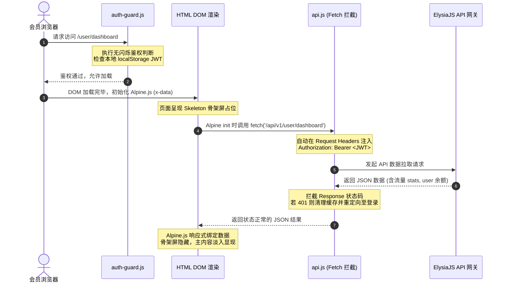

# SPanel-bun 前端静态页面路由设计方案

本项目前端部分采用**完全的前后端分离架构**。移除了旧版 Slim/PHP 在服务器端通过 Smarty 模板引擎进行的 HTML 渲染，转而使用部署于 Nginx 上的**纯静态 HTML + Alpine.js 响应式绑定**。

所有的前端路由解析、鉴权守卫和页面分发，全部交由浏览器端和 Nginx 完成，而后端 ElysiaJS 仅作为纯粹的 JSON 数据服务网关存在。

---

## 1. 物理文件目录结构 (Frontend File Structure)

静态页面存储于 `/public/` 目录下，并以功能模块为维度划分为子文件夹，以保持清晰的逻辑结构。

```text
/public/
├── index.html                   # 官网静态首页 (游客)
├── tos.html                     # 服务条款与免责声明 (游客)
├── 403.html                     # 403 无权限提示页
├── 404.html                     # 404 未找到提示页
├── 500.html                     # 500 服务器错误提示页
│
├── assets/                      # 全局公共静态资源
│   ├── css/
│   │   ├── main.css             # 核心基础设计系统 (暗黑模式, CSS 变量)
│   │   └── glassmorphism.css    # 玻璃拟态与组件微动画规范
│   └── js/
│       ├── api.js               # 统一 Fetch API 封装与拦截器 (JWT 自动注入)
│       └── auth-guard.js        # 前端核心路由鉴权守卫 (防未登录越权)
│
├── auth/                        # 游客与鉴权静态页 (无需登录)
│   ├── login.html               # 登录页
│   ├── register.html            # 注册页
│   ├── reset.html               # 找回密码申领页
│   └── reset-token.html         # 新密码提交页
│
├── user/                        # 普通会员专区静态页 (需 Auth 登录守卫)
│   ├── dashboard.html           # 仪表盘主控台
│   ├── nodes.html               # 节点连接提取与订阅管理
│   ├── shop.html                # 套餐购买商店
│   ├── bought.html              # 已购套餐记录
│   ├── tickets.html             # 工单反馈与跟进页
│   ├── profile.html             # 会员安全设置 (2FA, SSR密码, 重置端口)
│   ├── invite.html              # 邀请码获取与返利详情页
│   ├── relay.html               # 中转端口转发规则自建页
│   ├── detect.html              # 审计/屏蔽规则触发日志页
│   └── code.html                # 卡密/充值码兑换余额页
│
└── admin/                       # 超级管理员专区静态页 (需 AdminAuth 特权守卫)
    ├── dashboard.html           # 管理端全局数据总看板
    ├── users.html               # 会员账户列表分页与 CRUD (含一键模拟登录)
    ├── nodes.html               # 节点管理列表及二次配置
    ├── shop.html                # 商品套餐上架与修改
    ├── tickets.html             # 用户工单答复与全局管理
    ├── relay.html               # 全局端口中转规则管控
    ├── detect.html              # 屏蔽拦截规则及事件日志管理
    ├── block.html               # 临时锁定 IP 管理与一键解封
    ├── code.html                # 礼品充值卡密批量生成与库存
    └── coupon.html              # 优惠折扣代金券制作与管理
```

---

## 2. 路由美化与 Nginx 重写规则 (Pretty URLs)

为了提升前端 URL 的质感，摆脱传统 `.html` 扩展名，我们利用 Nginx 的 `try_files` 指令进行路由重写，将干净的美化路由直接映射到物理 HTML 文件。

### Nginx 路由重写配置
```nginx
server {
    listen 80;
    listen 443 ssl http2;
    server_name yourdomain.com;
    root /root/git/SPanel-bun/public;
    index index.html;

    # 开启 Gzip 极速传输静态文件
    gzip on;
    gzip_types text/html text/css application/javascript image/svg+xml;

    # 1. 前端 Pretty URL 重写核心
    # 允许访问 /user/dashboard 内部直接指向并渲染 /user/dashboard.html
    location / {
        try_files $uri $uri/ $uri.html /index.html;
    }

    # 2. 静态物理资源高速分发与缓存
    location /assets/ {
        expires 30d;
        access_log off;
    }

    # 3. 后端 API 反向代理
    location /api/ {
        proxy_pass http://127.0.0.1:3000;
        proxy_http_version 1.1;
        proxy_set_header Host $host;
        proxy_set_header X-Real-IP $remote_addr;
        proxy_set_header X-Forwarded-For $proxy_add_x_forwarded_for;
        proxy_set_header X-Forwarded-Proto $scheme;
    }

    # 4. 客户端订阅聚合反代
    location /link/ {
        proxy_pass http://127.0.0.1:3000;
        proxy_set_header Host $host;
        proxy_set_header X-Real-IP $remote_addr;
        proxy_set_header X-Forwarded-For $proxy_add_x_forwarded_for;
    }
}
```

---

## 3. 前端鉴权守卫设计 (Frontend Route Guard)

在前后端完全分离后，前端必须拥有一套独立、敏捷的路由守卫脚本 `/assets/js/auth-guard.js`。
*   该脚本需要在所有需要鉴权的静态 HTML 文件的 `<head>` 标签中**同步加载**。
*   在解析 DOM 之前判断用户状态，如无权限，使用 `location.replace()` 瞬间重定向，防止“内容闪现”问题。

### `auth-guard.js` 核心逻辑实现
```javascript
(function () {
    // 1. 定义路由角色要求
    const path = window.location.pathname;
    const isUserRoute = path.startsWith('/user/') || path === '/user';
    const isAdminRoute = path.startsWith('/admin/') || path === '/admin';
    const isAuthRoute = path.startsWith('/auth/') || path === '/auth';

    // 2. 从本地存储中安全读取 JWT 与 用户信息
    const jwt = localStorage.getItem('spanel_jwt');
    const userJson = localStorage.getItem('spanel_user');
    let user = null;

    if (userJson) {
        try {
            user = JSON.parse(userJson);
        } catch (e) {
            clearAuthAndRedirect();
        }
    }

    // 3. 拦截规则判定
    if (isUserRoute || isAdminRoute) {
        // 未登录用户，一律强重定向至登录页
        if (!jwt || !user) {
            clearAuthAndRedirect('/auth/login');
            return;
        }

        // JWT 简单过期时间判定 (前端预检，后端 API 做物理终检)
        if (isTokenExpired(jwt)) {
            clearAuthAndRedirect('/auth/login?expired=1');
            return;
        }

        // 非管理员尝试越权访问 /admin 路由，直接甩向 403 页面
        if (isAdminRoute && user.is_admin !== 1) {
            window.location.replace('/403');
            return;
        }
    }

    if (isAuthRoute) {
        // 已登录的活跃会员，禁止倒退到登录/注册页，直接甩向仪表盘
        if (jwt && user && !isTokenExpired(jwt)) {
            if (user.is_admin === 1) {
                window.location.replace('/admin/dashboard');
            } else {
                window.location.replace('/user/dashboard');
            }
        }
    }

    // --- 辅助工具函数 ---
    function isTokenExpired(token) {
        try {
            const base64Url = token.split('.')[1];
            const base64 = base64Url.replace(/-/g, '+').replace(/_/g, '/');
            const jsonPayload = decodeURIComponent(atob(base64).split('').map(function(c) {
                return '%' + ('00' + c.charCodeAt(0).toString(16)).slice(-2);
            }).join(''));
            const payload = JSON.parse(jsonPayload);
            
            // 缓存过期判定，预留 10 秒时间差
            return payload.exp < (Date.now() / 1000 - 10);
        } catch (e) {
            return true;
        }
    }

    function clearAuthAndRedirect(target = '/auth/login') {
        localStorage.removeItem('spanel_jwt');
        localStorage.removeItem('spanel_user');
        window.location.replace(target);
    }
})();
```

---

## 4. 历史 Slim 页面路由对应映射表

参考 Slim 3.x 路由配置文件 `routes.php`，原 Slim 控制器渲染 `.tpl` 模板的 `GET` 页面路由，全部重构为如下的纯前端静态 HTML 美化路由。

### 4.1 游客与鉴权页面 (Guest / Auth Pages)

| Slim 3.x 历史路由 | 对应控制器动作 | SPanel-bun 静态 HTML 物理位置 | 对应美化后前端 URL 路径 | 访问要求 |
| :--- | :--- | :--- | :--- | :--- |
| `/` | `HomeController:index` | `public/index.html` | `/` | 所有人开放 |
| `/tos` | `HomeController:tos` | `public/tos.html` | `/tos` | 所有人开放 |
| `/auth/login` | `AuthController:login` | `public/auth/login.html` | `/auth/login` | 限游客 (已登录自动跳 Dashboard) |
| `/auth/register` | `AuthController:register` | `public/auth/register.html` | `/auth/register` | 限游客 (已登录自动跳 Dashboard) |
| `/auth/password/reset`| `AuthController:reset` | `public/auth/reset.html` | `/auth/password/reset` | 限游客 |
| `/auth/password/token/{token}`| `AuthController:token` | `public/auth/reset-token.html` | `/auth/password/token` *(通过 query 获取 token)* | 限游客 |
| `/404` / `/405` | `HomeController:page404` | `public/404.html` / `403.html` | `/404` / `/403` | 所有人开放 |

---

### 4.2 会员中心页面 (User Console Pages)

| Slim 3.x 历史路由 | 对应控制器动作 | SPanel-bun 静态 HTML 物理位置 | 对应美化后前端 URL 路径 | 鉴权守卫层级 |
| :--- | :--- | :--- | :--- | :--- |
| `/user` | `UserController:index` | `public/user/dashboard.html` | `/user/dashboard` | `UserAuth` |
| `/user/node` | `UserController:node` | `public/user/nodes.html` | `/user/node` | `UserAuth` |
| `/user/shop` | `UserController:shop` | `public/user/shop.html` | `/user/shop` | `UserAuth` |
| `/user/bought` | `UserController:bought` | `public/user/bought.html` | `/user/bought` | `UserAuth` |
| `/user/ticket` | `UserController:ticket` | `public/user/tickets.html` | `/user/ticket` | `UserAuth` |
| `/user/profile` | `UserController:profile` | `public/user/profile.html` | `/user/profile` | `UserAuth` |
| `/user/invite` | `UserController:invite` | `public/user/invite.html` | `/user/invite` | `UserAuth` |
| `/user/relay` | `RelayController:index` | `public/user/relay.html` | `/user/relay` | `UserAuth` |
| `/user/detect` | `UserController:detect_index` | `public/user/detect.html` | `/user/detect` | `UserAuth` |
| `/user/code` | `UserController:code` | `public/user/code.html` | `/user/code` | `UserAuth` |

---

### 4.3 管理后台页面 (Admin Console Pages)

| Slim 3.x 历史路由 | 对应控制器动作 | SPanel-bun 静态 HTML 物理位置 | 对应美化后前端 URL 路径 | 鉴权守卫层级 |
| :--- | :--- | :--- | :--- | :--- |
| `/admin` | `AdminController:index` | `public/admin/dashboard.html` | `/admin/dashboard` | `AdminAuth` |
| `/admin/user` | `UserController:index` | `public/admin/users.html` | `/admin/user` | `AdminAuth` |
| `/admin/node` | `NodeController:index` | `public/admin/nodes.html` | `/admin/node` | `AdminAuth` |
| `/admin/shop` | `ShopController:index` | `public/admin/shop.html` | `/admin/shop` | `AdminAuth` |
| `/admin/ticket` | `TicketController:index` | `public/admin/tickets.html` | `/admin/ticket` | `AdminAuth` |
| `/admin/relay` | `RelayController:index` | `public/admin/relay.html` | `/admin/relay` | `AdminAuth` |
| `/admin/detect` | `DetectController:index` | `public/admin/detect.html` | `/admin/detect` | `AdminAuth` |
| `/admin/block` | `IpController:block` | `public/admin/block.html` | `/admin/block` | `AdminAuth` |
| `/admin/code` | `CodeController:index` | `public/admin/code.html` | `/admin/code` | `AdminAuth` |
| `/admin/coupon` | `AdminController:coupon` | `public/admin/coupon.html` | `/admin/coupon` | `AdminAuth` |

---

## 5. 动态数据渲染与交互生命周期 (Alpine.js Hydration)

每一个受保护的前端静态页面，在被加载到浏览器端后，均遵循统一的生命周期流程，从而实现响应式渲染与无感交互。

### 页面渲染与生命周期序列图


### 页面 API 交互示例 (以 `dashboard.html` 为例)
```html
<!DOCTYPE html>
<html lang="zh-CN" class="dark">
<head>
    <meta charset="UTF-8">
    <title>会员中心 - SPanel</title>
    <!-- 1. 同步加载核心鉴权守卫，防闪现越权 -->
    <script src="/assets/js/auth-guard.js"></script>
    
    <!-- 引入 Tailwind CSS CDN 与 ECharts 渲染流量图表 -->
    <script src="https://cdn.jsdelivr.net/npm/alpinejs@3.x.x/dist/cdn.min.js" defer></script>
    <link rel="stylesheet" href="/assets/css/main.css">
    <link rel="stylesheet" href="/assets/css/glassmorphism.css">
</head>
<body class="bg-slate-950 text-slate-100 min-h-screen" x-data="dashboardData()">

    <!-- Skeleton Loader 骨架屏占位 -->
    <div x-show="loading" class="fixed inset-0 bg-slate-950 z-50 flex items-center justify-center">
        <div class="animate-spin rounded-full h-12 w-12 border-t-2 border-b-2 border-indigo-500"></div>
    </div>

    <!-- 主体视图淡入显示 -->
    <div x-show="!loading" x-transition.duration.500ms class="container mx-auto p-6 space-y-6">
        <h1 class="text-3xl font-bold tracking-tight">你好，<span x-text="user.email"></span></h1>
        
        <div class="grid grid-cols-1 md:grid-cols-3 gap-6">
            <!-- 余额卡片 -->
            <div class="glass-panel p-6">
                <h3 class="text-slate-400 text-sm font-medium">可用余额</h3>
                <p class="text-2xl font-semibold mt-2">¥ <span x-text="user.money">0.00</span></p>
            </div>
            
            <!-- 流量已用卡片 -->
            <div class="glass-panel p-6">
                <h3 class="text-slate-400 text-sm font-medium">已用流量</h3>
                <p class="text-2xl font-semibold mt-2" x-text="formattedUsedTraffic()"></p>
            </div>

            <!-- 签到交互 -->
            <div class="glass-panel p-6 flex flex-col justify-between">
                <div>
                    <h3 class="text-slate-400 text-sm font-medium">每日签到</h3>
                    <p class="text-slate-500 text-xs mt-1" x-text="checkinText"></p>
                </div>
                <button 
                    @click="doCheckin" 
                    :disabled="!canCheckin"
                    class="mt-4 w-full py-2 px-4 rounded-lg font-medium text-sm transition-all duration-300 btn-primary disabled:opacity-50"
                    x-text="canCheckin ? '一键签到' : '已签到'"
                ></button>
            </div>
        </div>
    </div>

    <script src="/assets/js/api.js"></script>
    <script>
        function dashboardData() {
            return {
                loading: true,
                user: {},
                traffic: {},
                canCheckin: false,
                checkinText: '',

                async init() {
                    try {
                        // 异步拉取接口，api.js 会自动拦截请求头注入 JWT
                        const res = await api.get('/api/v1/user/dashboard');
                        if (res.code === 200) {
                            this.user = res.data.user_info;
                            this.traffic = res.data.traffic_stats;
                            this.canCheckin = res.data.checkin_status.can_checkin;
                            this.checkinText = this.canCheckin ? '今日尚未签到，签到可获得神秘流量奖励' : '今日已签到，请明天再来吧';
                        }
                    } catch (err) {
                        console.error('仪表盘加载失败', err);
                    } finally {
                        this.loading = false;
                    }
                },

                formattedUsedTraffic() {
                    if (!this.traffic.u) return '0.00 B';
                    const used = BigInt(this.traffic.u) + BigInt(this.traffic.d);
                    return formatBytes(used);
                },

                async doCheckin() {
                    if (!this.canCheckin) return;
                    this.loading = true;
                    try {
                        const res = await api.post('/api/v1/user/checkin');
                        alert(res.message);
                        if (res.code === 200) {
                            this.canCheckin = false;
                            this.checkinText = '签到成功！';
                            // 重新刷新数据
                            await this.init();
                        }
                    } catch (e) {
                        alert('签到失败，请稍后重试');
                    } finally {
                        this.loading = false;
                    }
                }
            }
        }

        function formatBytes(bytes) {
            const b = Number(bytes);
            if (b === 0) return '0.00 B';
            const k = 1024;
            const sizes = ['B', 'KB', 'MB', 'GB', 'TB'];
            const i = Math.floor(Math.log(b) / Math.log(k));
            return parseFloat((b / Math.pow(k, i)).toFixed(2)) + ' ' + sizes[i];
        }
    </script>
</body>
</html>
```

> [!TIP]
> **API 全生命周期网络拦截：**
> 前端全局引用的 `/assets/js/api.js` 使用 `window.fetch` 进行了轻量级二次封装，核心拦截器在检测到任意 HTTP 响应返回 `401 Unauthorized` 状态时，会判定为 JWT 在后端校验失效或已被废弃，将自动清空 `localStorage` 缓存并执行 `window.location.replace('/auth/login?expired=1')` 重定向回登录页面，确保无状态安全性的闭环。
