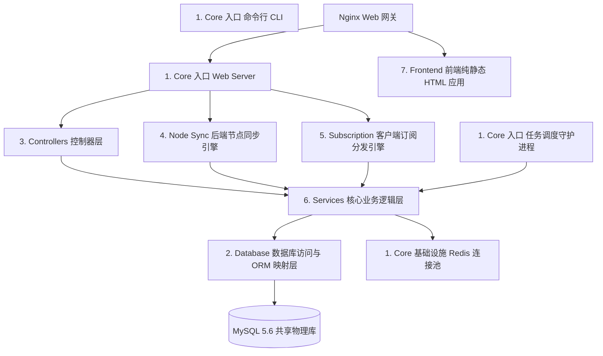

# SPanel-bun 全局重构模块划分与功能目录大纲

为了实现高质量的 **AI 模块化协作编码**，保障各层职责的绝对清晰，SPanel-bun 全栈项目（含后端 API、常驻后台及前端静态应用）被划分为 **7 大核心顶层模块**，细分为 **25 个具体功能子模块**。

本大纲详细规定了每个子模块的物理路径、核心逻辑、包含文件以及 AI 编写时的具体准则，作为全系统重写的核心参考蓝图。

---

## 🚀 模块关系与依赖拓扑图 (Dependency Topology)

系统依赖自底向上严格分层，禁止反向越级调用：



---

## 📦 1. 核心运行时与基础设施模块 (Core Runtime & Infrastructure)

此模块是全站启动的物理基石，定义了系统的全局依赖注入、通用限流守卫与中间件。

### M1.1：系统引导与多入口引导模块 (Bootstrap)
*   **物理路径**: `src/index.ts`, `src/scheduler.ts`, `src/cli.ts`
*   **职责**: 
    *   `index.ts`: 启动 ElysiaJS HTTP 服务，绑定端口（默认 3000），挂载全局路由与中间件。
    *   `scheduler.ts`: 启动常驻定时任务轮询监听。
    *   `cli.ts`: 挂载 Commander.js 提供运维命令行交互。
*   **AI 编写规则**: 禁止在引导入口写入具体的业务实现，必须保持入口轻量、干净。

### M1.2：全局配置管理器 (Configuration)
*   **物理路径**: `src/config/app.ts`
*   **职责**: 解析环境变量（`.env`）以及从数据库 `sp_config` 表中高速加载系统全局变量（如：`muKey`、充值折率等），在内存中统一提供类型安全的 Get 接口。
*   **AI 编写规则**: 对敏感数据（JWT Secret、密码 Salt）提供默认兜底，读取失败时抛出致命异常阻止服务器冷启动。

### M1.3：连接池管理器 (Connection Pools)
*   **物理路径**: `src/config/database.ts`, `src/config/redis.ts`
*   **职责**: 初始化 `mysql2` 数据库连接池并封装为 Drizzle 实例；初始化 `ioredis` 连接池。
*   **AI 编写规则**: 必须正确配置连接池的最大连接数、空闲超时以及断线重连（Keep-Alive）逻辑。

### M1.4：通用安全与路由中间件 (Common Middlewares)
*   **物理路径**: `src/middleware/`
    *   `auth.ts` —— **JWT 鉴权拦截器**：解析提取并校验 JWT 角色（User/Admin）。
    *   `ip.ts` —— **CDN 真实 IP 提取与封禁拦截**：解析 `CF-Connecting-IP` 并结合 QQWry IP 数据库拦截大陆访问。
    *   `pow.ts` —— **L7 级防 CC 攻击 POW 工作量证明预检器**。

---

## 🗄️ 2. 数据库访问与 Schema 隔离模块 (Database & Persistence)

确保完美兼容 MySQL 5.6，进行类型安全的实体关系映射。

### M2.1：Drizzle 强类型 Schema 定义 (ORM Schemas)
*   **物理路径**: `src/db/schema.ts`
*   **职责**: 严格映射共享数据库的所有表关系（用户、节点、订单、工单、卡密等）。
*   **AI 编写规则**: **坚决禁用原生 `.json()` 类型**（MySQL 5.6 不支持），使用 `text` 字段进行 TS 手动序列化；高频索引字段长度严禁超过 `varchar(191)`。

### M2.2：数据初始化与 CLI 填充 (CLI Seeder & Tools)
*   **物理路径**: `src/db/seed.ts`, `src/commands/createAdmin.ts`
*   **职责**: 执行新站数据初始化、填充默认配置种子数据，提供无交互式快速创建超级管理员账号的命令行逻辑。

---

## 🌐 3. 网页端 API 控制器模块 (Web Front-end API Controllers)

承接前端静态 HTML (Alpine.js) 的 Fetch 请求，实现路由参数预检与响应分发。

```text
src/controllers/
├── auth/                       # M3.1: 游客与安全鉴权接口
│   ├── login.ts
│   ├── register.ts
│   └── reset.ts
├── user/                       # M3.2: 登录会员专区接口 (大文件降维拆分)
│   ├── dashboard.ts
│   ├── shop.ts
│   ├── ticket.ts
│   ├── profile.ts
│   ├── relay.ts
│   └── invite.ts
└── admin/                      # M3.3: 运维管理端高特权接口
    ├── user.ts
    ├── node.ts
    ├── shop.ts
    ├── ticket.ts
    └── audit.ts
```

### M3.1：游客鉴权控制域 (Guest / Auth API Submodule)
*   **包含文件**: `src/controllers/auth/*`
*   **功能接口**: 登录核对、注册处理、图形验证码获取（结合 Redis 缓存校验）、邮箱验证码发送。

### M3.2：会员控制台控制域 (User Dashboard API Submodule)
*   **包含文件**: `src/controllers/user/*`
*   **功能接口**: 仪表盘图表数据提取、签到领流量、套餐购买商店、中转转发规则 CRUD、工单查看与追问、个人绑定 2FA、重置 SSR 加密配置与端口分配。

### M3.3：超级管理员控制域 (Admin API Submodule)
*   **包含文件**: `src/controllers/admin/*`
*   **功能接口**: 全平台会员多条件分页筛选、修改特定会员余额与属性、物理节点增删改查、套餐商品发布上架、用户工单答复与关闭、安全审计日志查询。

---

## 📡 4. 后端 VPN 节点高并发同步模块 (Backend Node Sync Engine)

直接对接边缘节点，属于高吞吐、高并发处理模块。

### M4.1：Mod_Mu / Mu 协议拉取服务 (Sync User Configs)
*   **物理路径**: `src/controllers/mu/users.ts`
*   **职责**: 接收边缘节点的心跳轮询，下发当前节点有权连接的有效 Shadowsocks/V2Ray 用户 Port/Password/UUID 配置。
*   **AI 编写规则**: **核心性能红线**，禁止直接直查 MySQL。必须通过 Redis 缓存 `node:sync:users` 快速响应，缓存失效时才允许被动重载。

### M4.2：批量流量上报接收服务 (Sync Traffic Aggregation)
*   **物理路径**: `src/controllers/mu/traffic.ts`
*   **职责**: 批量接收节点上报的流量消耗记录。
*   **AI 编写规则**: **异步写缓冲红线**，禁止在请求中 `UPDATE` 数据库。接口仅负责将 JSON 快速写入 Redis `queue:traffic:incoming` 队列并瞬间返回，由后台常驻 Worker 异步批量归并写回 MySQL。

---

## 🔗 5. 客户端订阅生成分发引擎模块 (Client Subscription Engine)

直接对接手机和电脑代理客户端软件，强调格式兼容性与极速响应。

### M5.1：User-Agent 智能拦截分流器 (UA Classifier)
*   **物理路径**: `src/services/subscription-service.ts`
*   **职责**: 解析读取 HTTP 头的 `User-Agent`，精准匹配 Clash、Surge、Shadowrocket 或 Quantumult X 标识并分流处理。

### M5.2：Clash & Mihomo 配置拼装器 (YAML Template Parser)
*   **职责**: 过滤用户可用节点，动态生成标准 Clash YAML 配置文件。

### M5.3：Surge & Quantumult X 配置拼装器 (Surge CONF Parser)
*   **职责**: 动态生成标准 Surge CONF 格式文件。

### M5.4：通用 Base64 订阅生成器 (Generic Base64 Subscription)
*   **职责**: 生成标准的 `ss://`、`trojan://` 通用代理串拼接后 Base64 编码纯文本。

---

## ⏰ 6. 任务调度器与后台异步 Worker 模块 (Background Jobs & Schedulers)

进程常驻内存，免去冷启动开销，提供后台流量吞吐合并和自动清理。

### M6.1：流量缓冲合并落盘 Worker (Traffic Batch Queue Worker)
*   **物理路径**: `src/commands/checkjob.ts` (常驻内存 Worker 模块)
*   **职责**: 每 5 秒定时消费 Redis `queue:traffic:incoming` 队列，在内存中归并去重，利用 Drizzle 批量事务安全回写 MySQL。

### M6.2：周期性自动数据清理任务 (Daily/Hourly Jobs)
*   **物理路径**: `src/commands/dailyjob.ts`
*   **职责**: 
    *   **每日零点结算**: 重置每日限额流量、扣减已到期会员等级回到 0 级、清除失效临时卡密。
    *   **系统巡检**: 清理过期 Redis 图形验证码及 2FA 缓存。

---

## 🖥️ 7. 前端静态 HTML 响应式模块 (Frontend Static App)

完全前后端解耦的浏览器端 HTML/JS 应用，提供 premium 暗黑毛玻璃视觉和无缝 API 交互。

### M7.1：全局拦截通信核 (API Communication Core)
*   **物理路径**: `public/assets/js/api.js`
*   **职责**: 封装全局 Fetch，请求时自动在 Headers 中追加 JWT；响应发生 401 错误时自动清空本地 `localStorage` 并执行 `/auth/login` 重定向。

### M7.2：防闪现导航守卫守护核 (Frontend Auth Guard)
*   **物理路径**: `public/assets/js/auth-guard.js`
*   **职责**: 在 HTML `<head>` 同步阻塞执行，解析 JWT 载荷，拦截未登录/非管理角色越权并瞬间重定向，防止内容闪烁。

### M7.3：官网与游客交互面板 (Guest Page Views)
*   **包含物理页面**: `public/index.html`, `public/tos.html`, `public/auth/`
*   **职责**: 官网介绍、登录/注册表单提交、自适应 Web Worker POW 哈希碰撞器执行。

### M7.4：会员控制台动态视图 (User Console Views)
*   **包含物理页面**: `public/user/*.html`
*   **职责**: 基于 Alpine.js 的仪表盘数据同步渲染、套餐购买与订单轮询结算、工单多轮对话跟进。

### M7.5：超级管理控制台动态视图 (Admin Console Views)
*   **包含物理页面**: `public/admin/*.html`
*   **职责**: ECharts 看板图表统计渲染、表格无刷新分页及模拟登录快速跳转。

---

## 📊 重构模块划分总览表

| 模块分类 | 子模块编号 | 模块名称 | 物理承载路径 (后端基于 TS, 前端基于 HTML/JS) |
| :--- | :--- | :--- | :--- |
| **1. 基础设施** | M1.1 | 引导启动模块 (Bootstrap) | `src/index.ts`, `src/scheduler.ts`, `src/cli.ts` |
| | M1.2 | 配置管理器 (Config) | `src/config/app.ts` |
| | M1.3 | 连接池管理器 (Pools) | `src/config/database.ts`, `src/config/redis.ts` |
| | M1.4 | 鉴权与安全中间件 (Middleware) | `src/middleware/auth.ts`, `ip.ts`, `pow.ts` |
| **2. 数据库** | M2.1 | 强类型 Schema 定义 (ORM) | `src/db/schema.ts` |
| | M2.2 | 种子填充与运维命令行 (CLI) | `src/db/seed.ts`, `src/commands/createAdmin.ts` |
| **3. 网页 API** | M3.1 | 游客控制域 (Guest API) | `src/controllers/auth/*` |
| | M3.2 | 普通会员控制域 (User API) | `src/controllers/user/*` |
| | M3.3 | 超级管理控制域 (Admin API) | `src/controllers/admin/*` |
| **4. 节点同步** | M4.1 | 用户列表同步 (Mod_Mu Get) | `src/controllers/mu/users.ts` |
| | M4.2 | 流量增量合并上报 (Mod_Mu Write) | `src/controllers/mu/traffic.ts` |
| **5. 订阅生成** | M5.1 | UA 分流器 (UA Classifier) | `src/services/subscription-service.ts` |
| | M5.2 | Clash 配置生成 (Clash YAML) | `src/services/subscription-service.ts` (Clash 模板) |
| | M5.3 | Surge 配置生成 (Surge CONF) | `src/services/subscription-service.ts` (Surge 模板) |
| | M5.4 | 通用 Base64 分发 (Generic B64) | `src/services/subscription-service.ts` (B64 模板) |
| **6. 定时任务** | M6.1 | 流量消费落盘 Worker (Batch) | `src/commands/checkjob.ts` |
| | M6.2 | 周期自动结算任务 (Cron) | `src/commands/dailyjob.ts` |
| **7. 前端 UI** | M7.1 | 通信拦截器 (Fetch API Core) | `public/assets/js/api.js` |
| | M7.2 | 路由拦截守卫 (Auth Guard) | `public/assets/js/auth-guard.js` |
| | M7.3 | 官网与游客页面 (Guest Views) | `public/index.html`, `public/auth/*.html` |
| | M7.4 | 会员中心视图 (User Views) | `public/user/*.html` |
| | M7.5 | 管理中心视图 (Admin Views) | `public/admin/*.html` |
