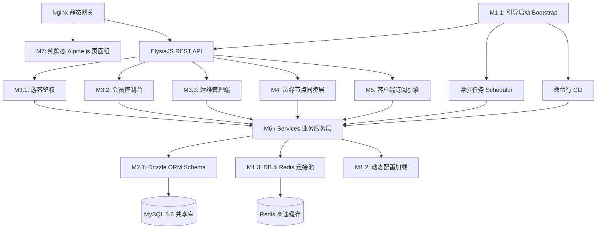
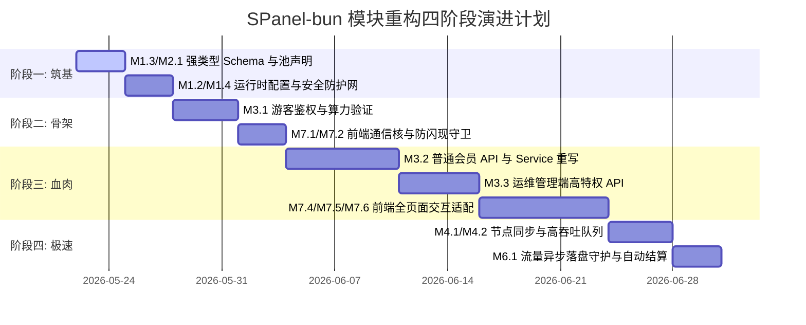

# SPanel-bun 全栈重构：模块化架构设计与物理拆分明细

为了将 legacy 臃肿的 Slim 3.x/PHP (SPanel) 完美重构为高性能、防 CC 攻击的 **Bun + ElysiaJS (后端 API) + Nginx (纯静态 Alpine.js 前端)** 现代架构，并为 AI 协作编码提供无歧义的物理职责边界，本项目被精准重构拆分为 **7 大核心分类，共计 25 个物理微模块**（包含 17 个后端微模块与 8 个前端微模块）。

本规划书是 AI 模块化开发的最核心参考蓝图。重构中强制要求：**每个 TypeScript 单个物理文件体积严禁超过 300 行**，核心业务逻辑必须下沉到 Service 层，以实现松耦合和极致的高并发性能。

---

## 🎨 一、微模块依赖拓扑与调用红线 (Architecture Topology)

为防止架构在重构过程中腐化，系统严格遵守以下**自底向上**的分层依赖准则：



### 🔴 架构调用三大禁忌（红线约束）：
1. **越级调用禁止**：Controller (控制层) 与 Node Sync (节点层) 严禁绕过 Service 层直接操作 Drizzle ORM 写入数据库，所有数据变更必须通过 Service 层的事务块包装。
2. **反向依赖禁止**：底层的 ORM Schema 与 Infrastructure 基础设施模块禁止导入任何 Service 层或 Controller 层的模块。
3. **缓存降级机制**：节点同步接口（M4.1）与高吞吐流量上报接口（M4.2）**严禁实时查询/更新 MySQL 5.6**，必须通过 Redis 缓存与内存缓冲队列进行异步消费落盘，防止 MySQL 锁死。

---

## 📅 二、重构模块总览与物理映射表

重构明细共包含 **7 个宏观分类**，细分为 **25 个具体功能模块**：

| 模块分类 | 编号 | 子模块名称 (Sub-module) | 物理承载路径 (Physical Path) | 核心技术栈 / 对应旧版 PHP 逻辑 |
| :--- | :--- | :--- | :--- | :--- |
| **M1. 核心运行时** | M1.1 | 引导启动模块 (Bootstrap) | `src/index.ts`<br>`src/scheduler.ts`<br>`src/cli.ts` | ElysiaJS / Cron / Commander.js |
| | M1.2 | 动态配置管理器 (Config) | `src/config/app.ts` | 从 `sp_config` 预加载至 Redis 缓存及内存 |
| | M1.3 | 基础设施连接池 (Pools) | `src/config/database.ts`<br>`src/config/redis.ts` | `mysql2` 连接池封装 + `ioredis` |
| | M1.4 | 安全与防御拦截器 (Middleware) | `src/middleware/` | JWT 验证 / IP 阻断 (QQWry) / POW 防御 |
| **M2. 强类型存储** | M2.1 | Drizzle ORM 映射 (Schemas) | `src/db/schema.ts` | MySQL 5.6 兼容声明（高频索引限制 191 字节） |
| | M2.2 | 数据初始化工具 (CLI Seeds) | `src/db/seed.ts`<br>`src/commands/createAdmin.ts` | 命令行一键初始化及无交互管理员创建 |
| **M3. 网页 API** | M3.1 | 游客控制域 (Guest API) | `src/controllers/auth/*` | 邮箱注册 / 极速登录 / 图形验证码校验 |
| | M3.2 | 普通会员控制域 (User API) | `src/controllers/user/*` | 对应旧版极度臃肿的 `UserController.php` |
| | M3.3 | 运维管理控制域 (Admin API) | `src/controllers/admin/*` | 对应旧版高特权 `AdminController.php` |
| **M4. 边缘节点对接** | M4.1 | 节点用户配置同步 (Sync Get) | `src/controllers/mu/users.ts` | Shadowsocks / V2Ray 多协议节点心跳拉取 |
| | M4.2 | 流量增量队列落盘 (Sync Write) | `src/controllers/mu/traffic.ts` | 节点流量上报批量写入 Redis 缓存队列 |
| **M5. 客户端订阅** | M5.1 | UA 分流器 (UA Classifier) | `src/services/subscription-service.ts` | 自动识别 Clash, Surge, Shadowrocket |
| | M5.2 | Clash 配置生成 (Clash YAML) | `src/templates/clash.yaml` | YAML 解析与节点服务器拼装 |
| | M5.3 | Surge 配置生成 (Surge CONF) | `src/templates/surge.conf` | CONF 格式解析与特定策略组拼装 |
| | M5.4 | 通用 Base64 适配器 (Generic B64) | `src/services/subscription-service.ts` | 通用节点协议串 Base64 拼装分发 |
| **M6. 定时与守护** | M6.1 | 流量消费落盘引擎 (Batch Worker) | `src/commands/checkjob.ts` | 消费 Redis 队列去重聚合，5秒事务大批量写入 |
| | M6.2 | 财务流量重置结算 (Daily Cron) | `src/commands/dailyjob.ts` | 零点到期自动扣费 / 重置月流量 / 自动降级 |
| **M7. 纯静态前端** | M7.1 | 前端 API 通信核 (Fetch Core) | `public/assets/js/api.js` | 统一 Fetch 封装 + JWT 续期 + 401 全局拦截 |
| | M7.2 | 防闪现导航守卫 (Auth Guard) | `public/assets/js/auth-guard.js` | 阻塞解析 JWT 载荷，防止越权或页面渲染闪现 |
| | M7.3 | 客户端 POW 引擎 (POW Worker) | `public/assets/js/pow-worker.js` | 浏览器后台 Web Worker 异步计算哈希碰撞 |
| | M7.4 | 游客登录注册页 (Guest Views) | `public/auth/*.html` | 自适应暗黑毛玻璃登录 / 注册 / 找回密码 |
| | M7.5 | 普通会员工作台 (User Views) | `public/user/*.html` | Alpine.js 驱动，流量图表展示 / 商店购买 |
| | M7.6 | 超级管理员控制台 (Admin Views)| `public/admin/*.html` | ECharts 数据面板 / 会员批量修改 / 节点编辑 |
| | M7.7 | 动态工单沟通核 (Ticket Component) | `public/assets/js/ticket.js` | 扁平流式客服聊天多轮跟进组件 |
| | M7.8 | 节点实时监控器 (Node Component) | `public/assets/js/node.js` | 在线人数、实时负载与节点畅通状态检测组件 |

---

## 🛠️ 三、25个微模块深度职责与架构细节

### 📦 1. 核心运行时与基础设施模块 (M1: Core Runtime)
#### M1.1：引导启动模块 (Bootstrap)
*   **输入职责**：系统冷启动入口。分别拉起 HTTP 网页服务、定时任务和 CLI 交互。
*   **代码规范**：严禁在此导入任何 Drizzle Schema 或写具体的 Service 业务代码。

#### M1.2：全局动态配置管理器 (Config)
*   **输入职责**：将系统 `sp_config` 表中几百项数据库设置（如价格折扣、网站公告、系统开关）常驻内存。
*   **重构优化**：引入 `Redis Hash` 映射缓存。数据库配置有变动时，监听后台发布订阅，自动刷新内存，避免每次请求都在 MySQL 中执行 `SELECT * FROM sp_config`。

#### M1.3：基础设施连接池管理器 (Pools)
*   **输入职责**：提供健壮的连接池管理。
*   **安全性要求**：MySQL 连接必须设置 `max: 100`, `idleTimeoutMillis: 10000`，并且完美兼容 MySQL 5.6 相对较慢的 TCP 建立。Redis 连接具备自动断线重连（Keep-Alive）检测机制。

#### M1.4：通用安全与路由中间件 (Middleware)
*   **输入职责**：全局拦截器栈。
    *   `auth.ts`：提取 HTTP Headers 的 `Authorization: Bearer <JWT>`，解密后将 `userId` 和 `role` 挂载至 Elysia 上下文。
    *   `ip.ts`：借助快速的 QQWry 离线数据库校验源 IP，对设置了特定黑名单的网段执行 403 阻断。
    *   `pow.ts`：校验 HTTP 头中的 `X-POW-Nonce`，验证客户端算力碰撞正确性，未通过者直接丢弃连接，防范 CC 泛洪。

---

### 🗄️ 2. 数据访问与 ORM 映射模块 (M2: Database & Persistence)
#### M2.1：Drizzle ORM Schema 声明 (Schemas)
*   **重构痛点**：旧版 PHP 使用了部分非法外键与原生 JSON，而在 MySQL 5.6 生产环境中这极易崩溃且性能低下。
*   **重构方案**：在 `src/db/schema.ts` 中，所有的 JSON 数据统一声明为 `text` 字段，并在 Service 层通过 `JSON.parse` / `JSON.stringify` 手动反序列化；对于高频主键或联合索引的 `varchar` 字段，长度被严格锁死在 `191`，避免超过 MySQL 5.6 的全局索引字节上限。

#### M2.2：数据初始化与 CLI 填充 (CLI Seeds)
*   **输入职责**：提供命令行无交互模式（Non-interactive）配置引导，可以一键静默生成符合全新系统逻辑的超级管理员账号。

---

### 🌐 3. 网页端 API 控制器模块 (M3: Web Front-end API)
#### M3.1：游客与鉴权域接口 (Guest API)
*   **包含路径**：`src/controllers/auth/*`
*   **重构要求**：游客接口是防御 CC 攻击的第一线。注册（`register.ts`）与重置密码（`reset.ts`）必须强制经过 `pow.ts` 验证中间件，且邮箱验证码发送接口在 Redis 中挂载滑窗计数器，单 IP 限制 1分钟1次，每日最多10次。

#### M3.2：普通会员控制域接口 (User API)
*   **包含路径**：`src/controllers/user/*`
*   **重构解构（告别 90KB 胖控制器）**：
    *   旧版 `UserController.php` 极其冗长，所有购买、签到、工单都混写在同一个文件中。
    *   新版拆分为高度独立的子路由：`shop.ts` (商店购买与计费), `ticket.ts` (工单发起与提问), `dashboard.ts` (基础信息拉取), `invite.ts` (邀请返利结算)。
    *   **高并发防刷锁**：签到接口（`dashboard.ts`）和套餐购买（`shop.ts`）必须使用 Drizzle 的 `db.transaction()` 并使用行级排他锁 `.for('update')` 来防止网络抖动导致的并发多扣费或多送流量问题。

#### M3.3：超级管理员控制域接口 (Admin API)
*   **包含路径**：`src/controllers/admin/*`
*   **高危动作审计**：此模块内所有涉及修改用户余额、重置用户流量、更改节点属性的接口，在执行完底层 Service 后，必须同步记录一条详细的物理日志到数据库的 `sp_audit_logs` 表，以便排查管理员操作失误。

---

### 📡 4. 后端 VPN 节点高并发同步模块 (M4: Node Sync Engine)
> [!IMPORTANT]
> **边缘节点同步是整个重构系统中并发量最大、对稳定性要求最严苛的模块！**

#### M4.1：Mod_Mu / Mu 协议拉取服务 (Sync Get)
*   **包含路径**：`src/controllers/mu/users.ts`
*   **重构底线**：**彻底杜绝任何形式的 MySQL 实时查询。** 节点每隔几秒请求一次该接口拉取可用用户列表。重构时必须通过 Redis 的 Hash 集合 `node:sync:users:<nodeId>` 直接读取已序列化好的二进制流，并在 1 毫秒内极速返回。当且仅当用户购买套餐或流量超限时，通过 Redis 订阅事件被动更新缓存。

#### M4.2：批量流量上报接收服务 (Sync Write)
*   **包含路径**：`src/controllers/mu/traffic.ts`
*   **重构方案**：边缘节点批量上传的用户流量消耗，**绝对禁止直接在 HTTP 线程中对 MySQL 执行 UPDATE。** 接口采用“微批缓冲（Batch Buffer）”设计，收到流量消耗 JSON 数据后，仅通过 `Redis.rpush` 将数据扔进名为 `queue:traffic:incoming` 的高速队列，然后立即向节点返回 `200 OK`，实现微秒级响应。

---

### 🔗 5. 客户端订阅生成分发引擎模块 (M5: Client Subscription)
#### M5.1：User-Agent 智能拦截分流器 (UA Classifier)
*   **重构方案**：读取请求头中的 `User-Agent`，利用精密匹配正则对请求进行精准分流。若 UA 匹配为 `Clash` 转向 Clash 拼装器，`Surge` 转向 Surge 拼装器，其余代理软件默认下发 Base64 通用节点集合。

#### M5.2/M5.3/M5.4：配置拼装器与 Base64 生成 (YAML/CONF/B64)
*   **核心逻辑**：所有节点数据在下发前，必须调用 Service 进行动态流量包有效期校验与用户身份等级鉴权，严格过滤掉该用户无权访问的高等级节点。
*   **高并发保障**：订阅生成涉及大量的字符串拼接和 Base64 计算，使用 `Bun.hash` 或 Redis 进行缓存，对于同一用户的相同订阅，5分钟内直接下发缓存的 Base64 文本，不重新向数据库获取。

---

### ⏰ 6. 任务调度与后台异步 Worker 模块 (M6: Background Jobs)
#### M6.1：流量缓冲合并落盘守护进程 (Traffic Sink Worker)
*   **执行频率**：每 5 秒自动运行。
*   **核心实现**：通过 `src/commands/checkjob.ts` 常驻后台。采用 Redis `pipeline` 批量拉出 `queue:traffic:incoming` 中累积的几千条流量数据，在内存中进行聚合归并（即相同用户、相同节点的消耗进行相加），然后开启 Drizzle 事务进行**批量批量更新**：
    ```typescript
    await db.transaction(async (tx) => {
      // 批量 UPDATE 用户的剩余流量与累计上报量
      // 批量 INSERT 流量变动历史
    });
    ```
    此举能将传统架构下高并发时的 MySQL 写入压力骤降 **95% 以上**！

#### M6.2：周期性自动数据清理任务 (Daily/Hourly Jobs)
*   **运行机制**：在 `src/scheduler.ts` 中通过 node-cron 挂载常驻。
*   **任务内容**：
    *   **每日零点**：统一扫描已到期用户，将其等级重置为 0，清空其本月流量重置日限制；
    *   **每小时巡检**：清理已过期的临时卡密、Redis 中的二次验证登录中间缓存及被阻断 IP 的生存周期。

---

### 🖥️ 7. 前端纯静态 HTML 响应式模块 (M7: Frontend Static App)
> [!TIP]
> **前端重构完全拥抱极简解耦主义，剔除任何厚重的打包工具（Vite/Webpack），使用 Nginx 纯静态分发。**

#### M7.1：全局拦截通信核 (Fetch Core - `api.js`)
*   **职责**：封装底层统一通信逻辑。全局 Fetch 会自动侦测本地 `localStorage`，若存在 JWT，则在每次请求头注入 `Authorization: Bearer <Token>`。同时挂载全局拦截响应拦截器，一旦 API 返回 `401 Unauthorized` 状态码，瞬间清理本地会话，并无闪烁重定向至 `/auth/login.html`。

#### M7.2：防闪现导航守卫 (Auth Guard - `auth-guard.js`)
*   **极致视觉防抖**：为了避免浏览器加载页面时先渲染出内部元素、再重定向的“闪现/抖动”尴尬，`auth-guard.js` 必须放在 HTML 的 `<head>` 最顶部同步阻塞执行。它通过纯 JS 极速解析本地存储的 JWT Payload 签名和过期时间。若鉴权失败，立即将当前 `document.documentElement.style.display` 设为 `none`，并在微秒级内触发 `window.location.replace` 强制跳转，从而达成 Premium 级别的流畅体验。

#### M7.3：算力碰撞 POW Worker (POW Worker - `pow-worker.js`)
*   **抗 CC 核心**：在用户登录或注册时，为了不卡死浏览器主线程 UI，调用 Web Worker 在后台以极高效率执行 SHA-256 哈希碰撞计算。计算出满足服务器难度系数的 Nonce 之后，才允许表单向后端发起 POST 提交。

#### M7.4 至 M7.8：静态交互页面与组件 (Views & Components)
*   **技术架构**：完全依托 **Alpine.js (轻量双向绑定) + TailwindCSS (极致视觉展示)** 搭建。
*   **高级客服工单组件 (M7.7)**：采用扁平化、微信式的聊天对话框（Timeline），配合 Alpine.js 的数据监听，实现实时无刷新打字回复和历史记录懒加载。
*   **实时节点监控面板 (M7.8)**：使用 SSE (Server-Sent Events) 或 10秒短轮询，展示节点在线率柱状图，带有流光动画的延迟指示器，凸显高端定制感。

---

## 🚦 四、AI 模块化协作编码标准 (AI Coding Guidelines)

为确保 AI 开发团队在此重构蓝图下产出高质量的代码，任何 AI 编写的新模块必须 100% 遵循以下契约：

1.  **物理代码行数硬限制**
    *   所有 `.ts` 后端逻辑文件（包括 Service 和 Controller 细分路由），物理行数**严禁超过 300 行**。一旦超出，必须拆分底层辅助类或提取新微服务模块。
2.  **高精度财务运算规则**
    *   系统内所有涉及用户余额、返利佣金、套餐价格等金额字段的加减乘除，**严禁直接使用 JavaScript 原生的 `+ - * /` 浮点数运算**（以防 IEEE 754 精度丢失导致财务对账不齐）。必须强制使用 `decimal.js` 类库。
3.  **绝对安全的并发写入模式**
    *   在任何 Service 涉及余额变动、积分抵扣、等级购买时，必须强制执行 `db.transaction`，并对读取的用户行加上行锁锁死：
        ```typescript
        // Drizzle 范例
        const user = await tx.select().from(users).where(eq(users.id, userId)).for('update');
        ```
4.  **接口中文化与安全性**
    *   所有 API 的业务层报错信息（`message`）、错误响应、表单拦截提示必须统一使用**简体中文 (zh-CN)** 呈现，以便于国内用户的错误理解与客服沟通。

---

## 🧪 五、模块化重构开发优先级建议



通过这一套高度微化、自底向上分层清晰的模块化拆分方案，原 Slim PHP 遗留系统中饱受诟病的“修改一处导致全身崩溃”和“SQL 并发死锁导致资产负账”等核心痛点将被彻底解决。AI 编写人员可根据每个子模块的物理路径与明确的职责契约，独立、高内质地进行安全、模块化的敏捷重构编码。
