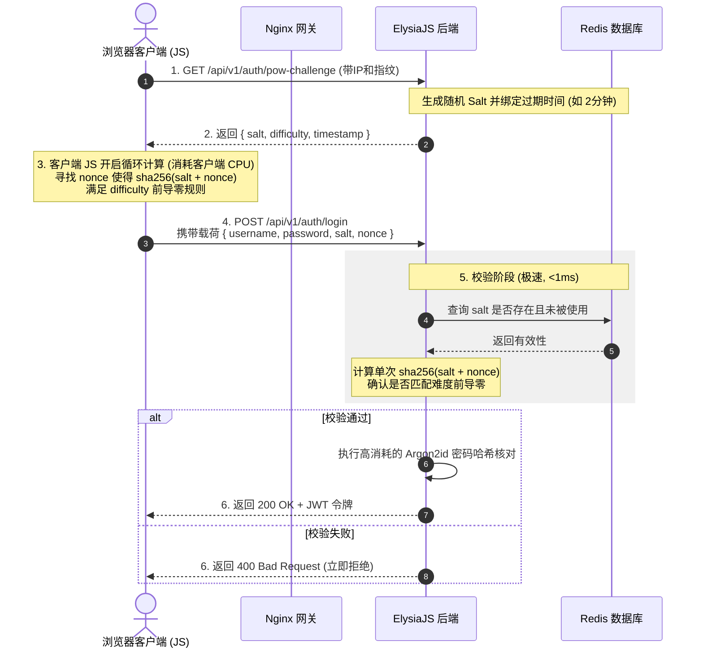

# SPanel-bun 防 CC 攻击与系统安全加固设计方案

本项目重写在追求极速响应的同时，将**系统防御与抗 L7 CC 攻击能力**作为核心设计指标。由于项目使用**前后端分离**架构，天然具备了静态资源与动态数据解耦的防御优势。

本方案针对您提出的安全构想进行深度剖析、细化和技术实现设计，重点围绕“无需登录页面静态化”、“未登录 POST 强引入 POW 验证”、“注册/登录统一收束 `/auth`”、“用户与管理员域名隔离隔离”以及“已登录基于 Redis 的用户级限流”展开。

---

## 目录
1. [安全架构总体概览](#1-安全架构总体概览)
2. [核心防 CC 方案设计](#2-核心防-cc-方案设计)
3. [POW (工作量证明) 验证流设计](#3-pow-工作量证明-验证流设计)
4. [用户端与管理端域名隔离设计](#4-用户端与管理端域名隔离设计)
5. [已登录 API 接口的 Redis 限流策略](#5-已登录-api-接口的-redis-限流策略)
6. [安全性验证与测试计划](#6-安全性验证与测试计划)

---

## 1. 安全架构总体概览

SPanel-bun 采用分层纵深防御体系。在面临 CC 攻击（每秒数万次请求）时，防御手段逐级生效，最大程度降低后端 Bun / Node.js 进程和 MySQL 数据库的计算负载：

```text
[ 外部请求流量 (包含 CC 攻击) ]
              │
              ├─── [ 静态页面请求 (.html, .js, .css) ]
              │           │
              │           ▼ (Nginx / CDN 直接分发, 零后端开销)
              │       [ 静态资源分发层 ]
              │
              └─── [ 动态 API 请求 (/api/*) ]
                          │
                          ▼ (Nginx 限流器过滤)
                      [ Nginx 网关过滤层 ]
                          │
                          ▼ (ElysiaJS 中间件校验)
                      [ 统一 /api/v1/auth 路由入口 ]
                          │
                          ├─── [ 未登录 POST 请求 ] ──► [ POW 验证 (CPU 消耗归于客户端) ]
                          │
                          └─── [ 已登录 API 请求 ] ──► [ JWT 验证 + Redis 用户级限流 ]
```

---

## 2. 核心防 CC 方案设计

### 2.1 无需登录页面 100% 静态化
*   **设计原理**：游客可直接访问的页面（如官网首页 `/`、服务条款 `/tos`、登录页 `/auth/login`、注册页 `/auth/register`、找回密码 `/auth/reset`）**100% 采用静态 HTML/CSS/JS 编写**。
*   **防御效果**：
    1.  **屏蔽后端压力**：攻击者对这些页面发起高频刷新时，请求直接在 Nginx 或 CDN 边缘节点被截获并直接返回。请求根本**不会触达后端 Bun 运行时**，更不会查询数据库，后端计算开销为 0。
    2.  **极高吞吐量**：Nginx 分发静态文件的吞吐量可达每秒数万次，配合 CDN 缓存可以抵御更大规模的洪峰。
*   **实现细则**：
    *   Nginx 开启 Gzip/Brotli 高效压缩。
    *   配置严苛的静态文件浏览器缓存及 CDN 边缘缓存响应头：`Cache-Control: public, max-age=3600, s-maxage=86400`。

### 2.2 注册/登录统一收束在 `/api/v1/auth`
*   **设计原理**：将所有未登录状态下的敏感写入接口（登录、注册、发送邮箱验证码、重置密码等）统一归纳至 `/api/v1/auth/*` 命名空间下。
*   **防御效果**：
    1.  **集中防御**：能够在此路由分组上挂载统一的 `POW Verification Middleware`（工作量证明中间件）。
    2.  **代码高内聚**：免去在各个零散路由控制器中重复编写人机防刷校验。
*   **接口例外机制**：
    *   `GET /api/v1/auth/pow-challenge`（获取工作量挑战哈希）以及 `GET /api/v1/auth/captcha`（获取图片验证码）为 GET 请求，不执行 POW 验证，但挂载基于 IP 的滑动窗口频率限制器（Redis 维护，单 IP 限制 10 次/分钟），防止挑战生成接口本身被 सीसी 刷爆。

---

## 3. POW (工作量证明) 验证流设计

传统的图片验证码或滑动验证码（Captcha）在大规模自动化 bot 或打码兔面前防线较弱，且高频调用图片验证码生成会严重消耗服务器 CPU。
**POW（工作量证明）方案**：将计算资源消耗的**成本转嫁给攻击者（客户端）**。服务器出题极其简单，客户端解题需要消耗大量 CPU 计算数秒，而服务器验证答案仅需 1 微秒（单次 SHA-256 计算）。

### 3.1 POW 交互时序图



### 3.2 动态难度算法设计 (Dynamic Difficulty)
POW 的难度值（前导零的个数）必须与服务器当前负载挂钩，实现**弹性自适应防御**：
1.  **常态（低负载）**：难度设为最低（例如前导零个数为 `3`）。普通用户浏览器仅需 `100ms - 200ms` 即可算完，用户毫无感知。
2.  **攻击态（高负载）**：当系统监控到服务器 CPU 占用率超过 70%，或 Redis 中 `/auth` 请求队列突增时，自动将难度提升至 `5` 或 `6`。
3.  **计算代价**：
    *   难度 `3`：约需要 4096 次 Hash 计算（用户无感知）。
    *   难度 `5`：需要约 1,048,576 次 Hash 计算（浏览器高负载运行 1.5 - 3 秒，攻击者 bot 发起 10,000 次请求就需要计算 10 亿次 Hash，攻击者自身的肉鸡或服务器将瞬间 CPU 耗尽崩溃）。

---

## 4. 用户端与管理端域名隔离设计

为防止横向越权、Cookie 劫持以及混淆视听的黑客攻击，用户面板和管理员面板在物理及域名层进行完全隔离：

*   **用户端面板域名**：`panel.yourdomain.com`（仅映射 `public/user/*` 的静态文件及 `/api/v1/user/*` 接口）。
*   **管理端面板域名**：`admin.yourdomain.com`（仅映射 `public/admin/*` 的静态文件及 `/api/v1/admin/*` 接口）。

### 4.1 隔离防护效果
1.  **跨站会话隔离**：管理员登录的 JWT Cookie 或 LocalStorage 仅能在 `admin.yourdomain.com` 下访问。即使普通用户的域名遭受到 XSS 漏洞侵袭，也完全无法窥探或劫持管理员域名的会话，物理上防范了跨站会话窃取。
2.  **隐藏安全资产**：管理域名 `admin.yourdomain.com` 可以不对公网全天候开放，例如：
    *   可以在 Nginx 上设置仅允许公司/维护者特定的静态 IP 访问。
    *   可以隐藏在 **Cloudflare Access** 或零信任安全网关之后，外部攻击者甚至连管理员登录入口都找不到。
3.  **Nginx 配置隔离实现**：

```nginx
# 1. 用户端虚拟主机配置
server {
    listen 443 ssl http2;
    server_name panel.yourdomain.com;
    root /root/git/SPanel-bun/public;

    location / {
        # 仅允许访问主页、未登录auth页面和用户中心页面
        try_files $uri $uri/ $uri.html /user/dashboard.html;
    }
    
    # 严格禁止此域名访问管理端静态目录
    location /admin/ {
        return 404;
    }

    # 仅反代普通用户接口和未登录接口
    location ~ ^/api/v1/(auth|user|payment)/ {
        proxy_pass http://127.0.0.1:3000;
        # 传递客户端真实 IP...
    }
    
    # 严格禁止此域名访问管理员接口
    location /api/v1/admin/ {
        return 403;
    }
}

# 2. 管理端虚拟主机配置
server {
    listen 443 ssl http2;
    server_name admin.yourdomain.com;
    root /root/git/SPanel-bun/public;

    # 安全加固：仅限特定维护者 IP 访问管理后台 (可选)
    # allow 183.12.34.56;
    # deny all;

    location / {
        # 默认重定向或仅展示管理界面
        try_files $uri $uri/ $uri.html /admin/dashboard.html;
    }

    # 仅允许反代管理员专属接口
    location /api/v1/admin/ {
        proxy_pass http://127.0.0.1:3000;
        # 传递真实 IP...
    }

    # 禁止在此域名处理普通用户或节点同步业务 (防流量混淆)
    location /api/v1/user/ {
        return 403;
    }
}
```

---

## 5. 已登录 API 接口的 Redis 限流策略

即使攻击者成功登录，或者利用爬虫账号对 `/api/v1/user/*` 的敏感接口发起高频调用，后端依然会通过基于 **Redis 的滑动窗口计数器 (Sliding Window)**，进行针对**单个用户身份 (User UID)** 的精细化限流保护：

### 5.1 滑动窗口限流算法设计
使用 Redis 的 `Sorted Set (ZSet)` 数据结构来实现完美的滑动窗口限流：
*   **键名**：`rate:limit:user:<uid>:<api_group>`
*   **成员**：值为当前请求的时间戳（毫秒数），分数（Score）同样设为该时间戳。
*   **算法流**：
    1.  当请求到达时，首先执行 `ZREMRANGEBYSCORE` 移出当前时间戳向前推 1 分钟之外的历史成员（清理过期窗口数据）。
    2.  执行 `ZCARD` 统计当前 ZSet 中的数组成员总数，判断是否超过该 API 组的限额。
    3.  若未超过：执行 `ZADD` 将本次请求时间戳存入，并执行 `EXPIRE` 设置 2 分钟生存时间防止冷键占内存，然后允许接口放行。
    4.  若已超过：直接拒绝并返回 `429 Too Many Requests` 以及 `Retry-After` 头部。

### 5.2 API 分级限速频次矩阵

根据接口的计算开销，制定如下精细化速率限制：

| API 属性 | 代表端点 | 每分钟限额 (单 UID) | 超出后果 | 防御目标 |
| :--- | :--- | :--- | :--- | :--- |
| **轻量级查询 API** | `/api/v1/user/dashboard` | 60 次 | 临时锁定 5 分钟 | 防数据抓取与刷单屏负载 |
| **中等开销 API** | `/api/v1/user/node` (涉及鉴权运算) | 20 次 | 临时锁定 10 分钟 | 防止频繁计算节点 bitmask 消耗 CPU |
| **重度写入 API** | `/api/v1/user/buy` / `/api/v1/user/ticket` | 5 次 | 临时锁定 30 分钟 | 防恶意刷单、薅羊毛与工单垃圾信息轰炸 |

---

## 6. 安全性验证与测试计划

为了检验安全体系是否切实可行，必须在开发完毕后进行如下攻防演练：

### 6.1 L7 模拟攻击测试
*   **测试方法**：在测试服务器部署完毕后，在另一台独立的高带宽机器上运行压测工具（如 `wrk` 或 `hey`），模拟 500 个并发线程以每秒 5000 次的速率高频请求 `POST /api/v1/auth/login`。
*   **验证标准**：
    1.  不携带合法 POW `nonce` 的请求，后端必须在 `5ms` 内极速拦截并丢弃，服务器 CPU 占用率应低于 5%。
    2.  携带不匹配挑战的垃圾 payload 时，数据库连接池不应被占满，业务服务不宕机。

### 6.2 域名越权边界测试
*   **测试方法**：使用 Postman 手动修改请求 Headers 里的 `Host`。
*   **验证标准**：通过用户域名 `panel.yourdomain.com` 发送含有管理员 JWT 身份的 `/api/v1/admin/user` 请求，必须被 Nginx 或 Elysia 中间件强行拦截，返回 `404` 或 `403`，保证隔离防线不破。
